# 🌐 Filament Translation Helper

<div align="center">

[](https://packagist.org/packages/qsque/filament-translation-helper)
[](https://packagist.org/packages/qsque/filament-translation-helper)
[](https://packagist.org/packages/qsque/filament-translation-helper)

**A powerful Filament plugin that provides automatic translations with intelligent fallback support for forms, tables, and resources.**

[Installation](#-installation) • [Quick Start](#-quick-start) • [Features](#-features)

</div>

---

## ✨ Features

- **🔄 Automatic Translation Discovery**: Fields, columns, and sections are automatically translated
- **🎯 Smart Fallback System**: Local translations → Package translations → Auto-generated labels
- **🌐 Multi-language Support**: Built-in language switching with session persistence
- **📝 Zero Configuration**: Works out of the box without any setup
- **🎨 Language Switcher**: Ready-to-use user menu item for your admin panel
- **⚡ Laravel 11 & 12 Support**: Compatible with the latest Laravel versions
- **🎯 Filament 4 Ready**: Built for the latest Filament architecture
- **🔧 Highly Configurable**: Customize locales, fallbacks, and translation paths

## 🚀 Installation

Install the package via Composer:

```bash
composer require qsque/filament-translation-helper
```

That's it! The package works out of the box with zero configuration. 🎉

## ⚡ Quick Start

### 1. Basic Usage (Zero Config)

Just use your forms and tables as usual - translations happen automatically:

**Resource:**
```php
use Qsque\FilamentTranslationHelper\Resources\BaseResource;

class UserResource extends BaseResource
{
    protected static ?string $model = User::class;
    
    // Resource labels are automatically translated from:
    // resources.user.label and resources.user.plural_label
}
```

**Form:**
```php
use Filament\Forms\Form;
use Filament\Forms\Components\TextInput;

public function form(Form $form): Form
{
    return $form->schema([
        TextInput::make('name'),        // → "Name" or translated
        TextInput::make('email'),       // → "Email" or translated
        TextInput::make('first_name'),  // → "First Name" or translated
    ]);
}
```

**Table:**
```php
use Filament\Tables\Table;
use Filament\Tables\Columns\TextColumn;

public function table(Table $table): Table
{
    return $table->columns([
        TextColumn::make('name'),       // → "Name" or translated
        TextColumn::make('created_at'), // → "Created At" or translated
    ]);
}
```

### 2. Add Translation Files (Optional)

Create translation files for custom labels:

```php
// lang/en/common.php
return [
    'fields' => [
        'name' => 'Full Name',
        'email' => 'Email Address',
        'created_at' => 'Registration Date',
    ],
];

// lang/ru/common.php  
return [
    'fields' => [
        'name' => 'Полное имя',
        'email' => 'Email адрес',
        'created_at' => 'Дата регистрации',
    ],
];
```

### 3. Add Language Switcher (Optional)

```php
use Qsque\FilamentTranslationHelper\Components\LanguageSwitcher;

public function panel(Panel $panel): Panel
{
    return $panel
        ->userMenuItems([
            LanguageSwitcher::getUserMenuItem(),
        ]);
}
```

## 🎯 How It Works

### Translation Lookup Strategy

The plugin automatically translates fields using this intelligent fallback system:

```mermaid
graph TD
    A[Field: 'first_name'] --> B{Resource-specific translation?}
    B -->|Yes| C[resources.user.fields.first_name]
    B -->|No| D{Common field translation?}
    D -->|Yes| E[common.fields.first_name]
    D -->|No| F{Package translation?}
    F -->|Yes| G[filament-translation-helper::common.fields.first_name]
    F -->|No| H{Base name translation?}
    H -->|Yes| I[common.fields.first &#40;for 'first_name'&#41;]
    H -->|No| J[Auto-generate: 'First Name']
```



### Translation Hierarchy Examples

| Field Name | Translation Lookup Order |
|------------|-------------------------|
| `name` | `resources.user.fields.name` → `common.fields.name` → `"Name"` |
| `email` | `resources.user.fields.email` → `common.fields.email` → `"Email"` |
| `config.api_key` | `resources.user.fields.config.api_key` → `common.fields.config` → `"Config"` |

## 📁 Translation File Structure

### Resource-Specific Translations

```php
// lang/en/resources.php
return [
    'user' => [
        'label' => 'User',
        'plural_label' => 'Users',
        'fields' => [
            'name' => 'User Name',
            'email' => 'Email Address',
        ],
        'sections' => [
            'general' => 'General Information',
            'security' => 'Security Settings',
        ],
        'columns' => [
            'created_at' => 'Registration Date',
        ],
    ],
];
```

### Common Field Translations

```php
// lang/en/common.php
return [
    'fields' => [
        'name' => 'Name',
        'email' => 'Email',
        'password' => 'Password',
        'created_at' => 'Created At',
        'updated_at' => 'Updated At',
        // ... hundreds of pre-built translations
    ],
];
```

## 🔧 Advanced Configuration

### Custom Configuration

Publish the config file to customize behavior:

```bash
php artisan vendor:publish --tag="filament-translation-helper-config"
```

```php
// config/filament-translation-helper.php
return [
    'available_locales' => [
        'en' => 'English',
        'ru' => 'Русский',
        'es' => 'Español',
        'fr' => 'Français',
        'de' => 'Deutsch',
    ],
    
    'default_locale' => env('APP_LOCALE', 'en'),
    
    'fallback_locale' => 'en',
    
    'session_key' => 'filament_locale',
];
```

### Custom Resource Keys

Override the resource translation key:

```php
class UserProfileResource extends Resource
{
    protected static function getResourceKey(): string
    {
        return 'user-profile'; // Uses resources.user-profile.*
    }
}
```

### Middleware Setup (Optional)

Add locale persistence across requests:

```php
use Qsque\FilamentTranslationHelper\Http\Middleware\SetLocale;

public function panel(Panel $panel): Panel
{
    return $panel
        ->middleware([
            SetLocale::class,
        ]);
}
```

## 🛠️ Advanced Usage

### Manual Translation Helper

```php
use Qsque\FilamentTranslationHelper\Support\TranslationHelper;

// Get translation with automatic fallback
$label = TranslationHelper::getWithFallback('sections.user_details');
// Returns: "User Details" (auto-generated) or actual translation

// Check if translation exists
if (TranslationHelper::hasTranslation('common.fields.custom_field')) {
    // Use translation
}
```

### BaseResource Class

Extend BaseResource for automatic resource label translation:

```php
use Qsque\FilamentTranslationHelper\Resources\BaseResource;

class UserResource extends BaseResource
{
    protected static ?string $model = User::class;
    
    // Automatically translates:
    // - getLabel() from resources.user.label
    // - getPluralLabel() from resources.user.plural_label
}
```

### Custom Translation Logic

```php
use Qsque\FilamentTranslationHelper\Contracts\TranslationStrategy;

class CustomTranslationStrategy implements TranslationStrategy
{
    public function getTranslation(string $key, string $fallback = null): string
    {
        // Your custom translation logic
    }
}
```

## 📦 Package Translations

The package includes pre-built translations for common fields in multiple languages:

- **English** (en)
- **Russian** (ru)

### Publishing Package Translations

```bash
# Publish to customize package translations
php artisan vendor:publish --tag="filament-translation-helper-lang"
```

## 🎨 Language Switcher Customization

### Basic Usage

```php
// In your PanelProvider
public function panel(Panel $panel): Panel
{
    return $panel
        ->userMenuItems([
            LanguageSwitcher::getUserMenuItem(),
        ]);
}
```

### Custom Implementation

```php
// You can also implement your own user menu item
use Filament\Support\Facades\FilamentView;
use Filament\Navigation\MenuItem;
use Filament\Forms\Components\Radio;

MenuItem::make()
    ->label(config('filament-translation-helper.available_locales')[app()->getLocale()])
    ->icon('heroicon-o-language')
    ->form([
        Radio::make('locale')
            ->options(config('filament-translation-helper.available_locales'))
            ->default(app()->getLocale())
            ->inline(false)
            ->hiddenLabel(),
    ])
    ->action(function (array $data) {
        return redirect()->to(route('locale.switch', $data['locale']));
    })
```

## 🔍 Examples in Action

### Form Example

```php
use Filament\Forms\Form;
use Filament\Forms\Components\TextInput;
use Filament\Forms\Components\Toggle;
use Filament\Forms\Components\Section;

public function form(Form $form): Form
{
    return $form->schema([
        Section::make('general') // → "General" or translated
            ->schema([
                TextInput::make('name')      // → "Name" or translated
                    ->required(),
                TextInput::make('email')     // → "Email" or translated
                    ->email(),
            ]),
            
        Section::make('settings')    // → "Settings" or translated
            ->schema([
                Toggle::make('is_active') // → "Is Active" or translated
                    ->default(true),
            ]),
    ]);
}
```

### Table Example

```php
use Filament\Tables\Table;
use Filament\Tables\Columns\TextColumn;
use Filament\Tables\Columns\BooleanColumn;

public function table(Table $table): Table
{
    return $table
        ->columns([
            TextColumn::make('id')         // → "ID"
                ->sortable(),
            TextColumn::make('name')       // → "Name" or translated
                ->searchable(),
            TextColumn::make('email')      // → "Email" or translated
                ->searchable(),
            BooleanColumn::make('is_active') // → "Is Active" or translated,
            TextColumn::make('created_at') // → "Created At" or translated
                ->dateTime(),
        ]);
}
```

## 📄 License

The MIT License (MIT). Please see [License File](LICENSE.md) for more information.

## 💝 Credits

- [Qsque](https://github.com/qsque)
- [All Contributors](../../contributors)

---

<div align="center">

**Made with ❤️ for the Filament community**

[⭐ Star on GitHub](https://github.com/qsque/filament-translation-helper) • [🐛 Report Issues](https://github.com/qsque/filament-translation-helper/issues) • [💬 Discussions](https://github.com/qsque/filament-translation-helper/discussions)

</div>
